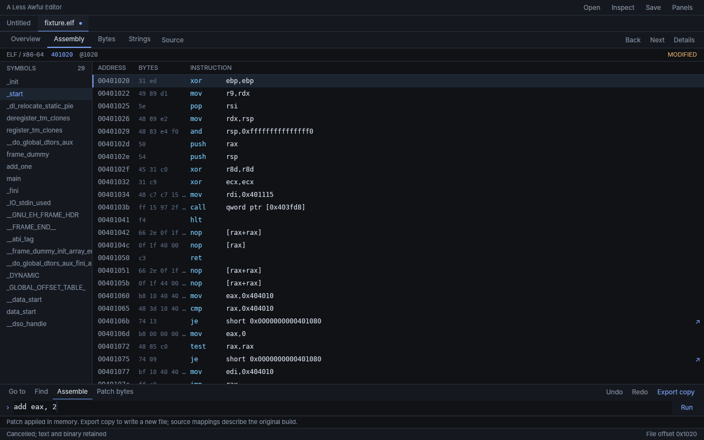

# A Less Awful Editor

A native, local-first text editor and binary workbench for programmers who want
to edit source code and inspect compiled files in one workspace.

Edit UTF-8 text, follow machine instructions, inspect bytes and control flow,
and preview binary patches before exporting a separate copy. Your text stays
open when you switch to binary views. No account or cloud service is required.

## What you can do

- Open, edit, and save text with Unicode navigation, selection, clipboard, and undo/redo.
- Inspect ELF, PE, and Mach-O files with linked assembly, bytes, symbols, and strings.
- Explore x86/x86-64 functions and control-flow graphs, and navigate to source when DWARF information is available.
- Preview instruction or byte edits, undo patches, and export to a new file without overwriting the original.
- View recovered pseudocode for supported Linux x86-64 binaries with the optional native decompiler.



## Run

Requires stable Rust and the native libraries listed below. From the project folder:

```bash
cargo run --locked -p a-less-awful-editor
```

### Linux setup

On Debian/Ubuntu-derived systems:

```bash
sudo apt-get install build-essential clang cmake libasound2-dev \
  libfontconfig-dev libglib2.0-dev libssl-dev libvulkan1 \
  libwayland-dev libx11-xcb-dev libxkbcommon-dev libxkbcommon-x11-dev \
  xdg-desktop-portal xdg-desktop-portal-gtk
```

Use the portal backend appropriate to your desktop. Launch from a graphical
session with D-Bus and a Vulkan-capable driver. Run Cargo as your normal user.
If the file picker fails, check that your desktop portal is running.

Instruction assembly also requires `/usr/bin/nasm` (`sudo apt-get install nasm`).
Inspection and byte patching work without it.

## Start using it

- **Ctrl+O** opens text; **Ctrl+S** saves; **Ctrl+Shift+S** saves under another name.
- **Ctrl+Shift+O** opens a binary for inspection.
- **Ctrl+1** returns to your text; **Ctrl+2**, **Ctrl+3**, and **Ctrl+4** show binary overview, assembly, and bytes.
- **Export copy** writes patched bytes to a new file.

Read the [text editing guide](docs/scratch-editor.md),
[binary workbench guide](docs/systems-workbench.md), or
[optional decompiler setup](tools/native-decompiler/README.md) for controls and supported inputs.

## Practical limits

Text files must be regular UTF-8 files no larger than 16 MiB; binary inspection
accepts files up to 64 MiB. Symlink paths are rejected. Overwriting existing text
files is supported on Linux; use Save As to a new file on other systems.

There is no integrated terminal, Git client, debugger, or syntax highlighting.
Binary patches do not repair relocations, signatures, or checksums. Recovered
pseudocode uses inferred names and types; it is not the original source.
