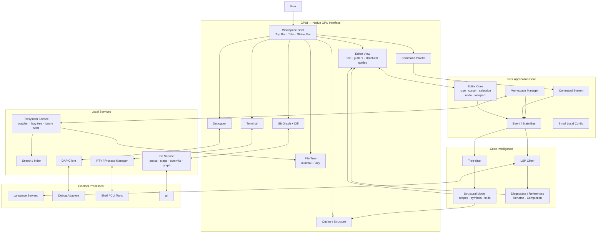

# System Design

A Less Awful Editor is a local-first native IDE focused on speed, structural clarity, strong Git/debugging/terminal workflows, and minimal UI chrome.

## Design goals

- Native, GPU-rendered UI.
- Editing must remain responsive even when optional subsystems fail or stall.
- No account, collaboration, cloud-sync, subscription, or product-growth dependencies in the core.
- Tree-sitter is a first-class structural subsystem, not just a syntax highlighter.
- LSP and DAP are protocol clients; language servers and debug adapters remain external processes.
- GPUI renders the editor but does not own the editor model.
- The filesystem, Git, terminal, debugger, and code structure should feel integrated without making the interface visually busy.

## High-level architecture



## Architectural boundary

The editor model must be independent from GPUI.

```text
                   a_less_awful_editor
                          |
           +--------------+--------------+
           |                             |
      PRODUCT LAYER                 ENGINE LAYER
           |                             |
         GPUI                           Rust
           |                             |
   +-------+--------+        +-----------+------------+
   |       |        |        |           |            |
 Files   Editor    Git     Buffer    Workspace    Services
          |                   |
          +---------+---------+
                    |
              Structural Model
                    |
             +------+------+
             |             |
        Tree-sitter        LSP
```

`editor-core` owns text, selections, cursor state, undo/redo, viewport state, decorations, and edit operations. It must have no GPUI dependency.

GPUI receives model state and renders it. If the UI framework ever becomes limiting, the renderer should be replaceable without rewriting the editor engine.

## Structural model

Tree-sitter feeds one shared structural representation used by every code-structure feature.

```text
Tree-sitter
     |
     v
Structural Model
     |
     +-- Outline
     +-- Breadcrumbs
     +-- Sticky scopes
     +-- Folding
     +-- Scope connectors
     +-- Structural selection
```

This avoids implementing each structural feature as an independent UI hack.

## Editing hot path

Typing must never wait for the LSP, Git, filesystem indexing, debugger state, or terminal processes.

```text
keypress
   |
   v
Editor Core
   |
   +----------------> repaint changed region --------> GPU
   |
   v
Rope mutation
   |
   v
incremental Tree-sitter edit
   |
   v
changed syntax/scopes only
   |
   +----------------> update structural guides
   |
   +----------------> update outline if necessary

              asynchronously
                    |
                    v
                   LSP
                    |
          diagnostics / semantics
                    |
                    v
              decorate editor
```

## Failure isolation

The editor remains usable when optional subsystems fail.

- Language server crashes -> editing still works.
- Git fails -> editing still works.
- Debug adapter exits -> editing still works.
- Indexer rebuilds -> editing still works.
- Terminal process dies -> editing still works.

This is a core invariant, not a later optimization.

## Proposed crate layout

```text
a_less_awful_editor-/
|
+-- crates/
|   +-- app/                 # startup + orchestration
|   +-- ui/                  # GPUI shell/components
|   +-- editor-core/         # text model; NO GPUI dependency
|   +-- editor-view/         # GPUI renderer
|   +-- workspace/           # projects + files
|   +-- syntax/              # Tree-sitter
|   +-- language/            # LSP
|   +-- git/                 # Git model
|   +-- debug/               # DAP
|   +-- terminal/            # PTY
|   +-- search/              # project search/index
|   +-- config/              # intentionally small local config
|
+-- assets/
+-- queries/                 # Tree-sitter queries
+-- docs/
|   +-- architecture.md
|
+-- Cargo.toml
```

## Initial technology choices

| Concern | Direction |
| --- | --- |
| Application language | Rust |
| Native UI | GPUI |
| Text storage | Rope-based editor core |
| Parsing / structure | Tree-sitter |
| Language intelligence | LSP |
| Debugging | DAP |
| Terminal | Native PTY + GPU-rendered terminal view |
| Git | Local Git integration with visual graph/diff/staging |
| Configuration | Small local human-readable config |

## Non-goals for the core

The core does not require:

- user accounts
- collaboration
- cloud workspaces
- subscription state
- remote containers
- product chat
- AI agents
- extension marketplace
- telemetry-driven UI clutter

Those can only exist later as optional, isolated capabilities if they ever earn their complexity.
