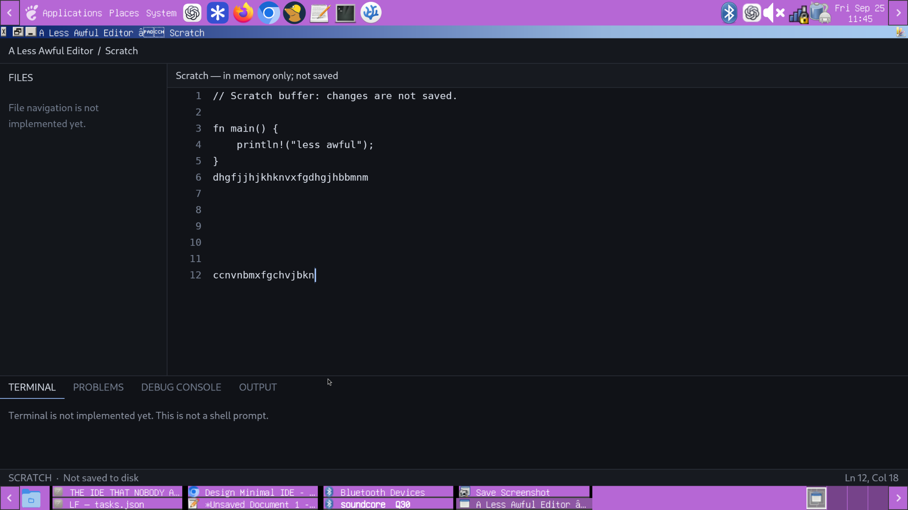

# Project state and screenshot provenance

NEW EDITOR, Minimal IDE, and A Less Awful Editor are names for one project.
The GitHub snapshot and the newer local checkpoint must not be confused.

## Checkpoints

| State | Branch / commit | Evidence |
| --- | --- | --- |
| Single-file foundation available here | Original main milestone `4db630bfdaef06bcd70e561398e0194517df3c39` | Source inspected; checked-in record reports 35 tests and Linux X11 native acceptance |
| Later local systems workbench | `codex/systems-workbench`, `4e9ffe3` | September 30 handoff and NEW EDITOR state record report 76 tests and native acceptance; source and results not independently inspected or rerun in this checkout |
| Isolated analysis integration WIP | `codex/analysis-wip-20260927`, `f159826a327c476e5acc4bcf19798b19be375346` | Uncompiled and untested Rust analysis draft; separate native typed-decompiler fixture evidence is not proof of editor integration |

The later workbench record includes file tabs, linked source/assembly/byte
locations, binary metadata, x86 decoding, aligned assembly/hex views,
patch preview/history, safe copy export, and separate text/binary dirty-close
decisions. Reported native acceptance includes exact export/reopen checks,
compact and zoomed layouts, cancellation, and clean/approved close.

The local validation document is named `docs/systems-validation.md`; the WIP
handoff is `docs/analysis-wip.md`. Neither is present on the inspected remote
branches. The September 30 reconciliation did not rerun validation or inspect
local git status. The short application commit did not resolve through this
repository's GitHub commit API during the October 1 audit.

Before featuring the workbench, inspect and publish that verified application
checkpoint with its validation record, preserving the separate WIP branch.
Do not substitute these notes for runnable source. IME, other OS/Wayland paths,
durability, and filesystem races remain unverified; the record does not prove
a finished decompiler or a universal workspace backend.

## Historical screenshot

This existing September 25 screenshot shows the earlier running scratch editor,
including the explicit unsaved-buffer and nonfunctional-terminal notices.
It predates both the single-file persistence milestone and the local systems
workbench. It demonstrates the native shell, not current binary or export
features. The original pixels are preserved.

A second September 25 image showed an earlier shell with a file tree and
`$ cargo run` display. It was not selected as feature evidence because those
UI placeholders could imply implemented navigation or a working terminal.
